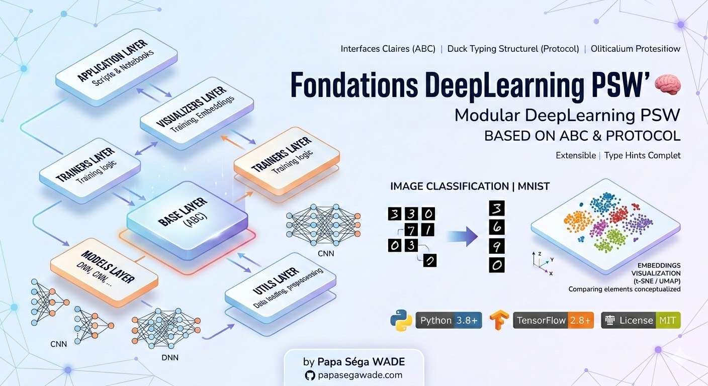

# PSW Deep Learning Foundations 🧠

🇬🇧 **English Version** | [🇫🇷 Lire en français](../README.md)



> **Educational Material**: This repository contains course materials, practical exercises, and solutions for learning Deep Learning.
> 
> **Note:** The current version uses **TensorFlow and Keras**. A **PyTorch** version will be available soon!

[](https://www.python.org/downloads/)
[](https://www.tensorflow.org/)
[](../LICENSE)

Collection of Deep Learning models and tools with a modular architecture based on Python's **Abstract Base Classes (ABC)** and **Protocol**.

**Author:** [Papa Séga WADE](https://papasegawade.com/)

---

## 📋 Table of Contents

- [About](#about)
- [Architecture](#architecture)
- [Installation](#installation)
- [Usage](#usage)
- [Project Structure](#project-structure)
- [Available Models](#available-models)
- [Visualizations](#visualizations)
- [Contribution](#contribution)

---

## 🎯 About

This project provides a clean, modular implementation of deep learning models for MNIST image classification. It uses Python programming best practices with:

- **ABC (Abstract Base Classes)** to define clear interfaces
- **Protocol** for structural duck typing
- Comprehensive **Type hints** for type safety
- Easily extensible **Modular architecture**
- **Separation of concerns** (models, trainers, visualizers)

### Main Features

✅ DNN and CNN models for MNIST
✅ Embeddings extraction and visualization (t-SNE, UMAP)
✅ Training history visualization
✅ Ready-to-use training scripts
✅ Interactive Jupyter Notebooks
✅ Extensible architecture for new models

---

## 🏗️ Architecture

The project follows a layered architecture with abstract base classes:

```
┌─────────────────────────────────────┐
│         Application Layer           │
│  (Scripts & Notebooks)              │
├─────────────────────────────────────┤
│      Visualizers Layer              │
│  (Training, Embeddings)             │
├─────────────────────────────────────┤
│        Trainers Layer               │
│  (Training logic)                   │
├─────────────────────────────────────┤
│         Models Layer                │
│  (DNN, CNN, ...)                    │
├─────────────────────────────────────┤
│        Base Layer (ABC)             │
│  (ModelBase, TrainerBase, ...)      │
├─────────────────────────────────────┤
│         Utils Layer                 │
│  (Data loading, preprocessing)      │
└─────────────────────────────────────┘
```

---

## 📦 Installation

### Prerequisites
- Python 3.8 or higher
- pip

### Installing Dependencies

```bash
# 1. Clone the repository
git clone https://github.com/papasega/Fondations-DeepLearning-PSW.git
cd Fondations-DeepLearning-PSW

# 2. Create and activate a virtual environment (Recommended)
python3 -m venv env_dl
source env_dl/bin/activate

# 3. Install dependencies
pip install -r requirements.txt
```

---

## 🚀 Usage

### Option 1: Python Scripts
Train a DNN or CNN:
```bash
python scripts/train_dnn.py
python scripts/train_cnn.py
```

### Option 2: Jupyter Notebooks
You can launch Jupyter to explore the interactive tutorials:
```bash
jupyter notebook
```

---

## 📁 Project Structure (Educational)

```
Fondations-DeepLearning-PSW/
│
├── Cours/                      # Slides and course notes
│   └── Module_00_Intro_Python/ # Introduction to Python (Basics)
│
├── Travaux_Pratiques/          # Empty/fill-in-the-blank Notebooks for students
│   └── Module_00_Intro_Python/ # Intro Practical Work
│
├── Solutions/                  # Completed/corrected Notebooks
│   ├── Module_00_Intro_Python/ # Solutions for Intro PW
│   ├── DNN_MNIST_psw.ipynb
│   ├── CNN_MNIST_Embeddings.ipynb
│   └── psw-Deblurring_PnP_DnCNN_FB.ipynb
│
├── core_framework/             # Base classes for PWs
│   ├── base/                   # ABC and Protocols
│   ├── models/                 # Reference models
│   ├── trainers/               # Training logic
│   ├── visualizers/            # Visualization tools
│   └── utils/                  # Data utilities
│
├── scripts/                    # Test training scripts
├── docs/                       # Additional documentation
├── assets/                     # Images, etc.
├── requirements.txt            # Python dependencies
└── README.md                   # Main French file
```

---

## 👨‍🎓 Author

**Papa Séga WADE**
- Portfolio: [https://papasegawade.com](https://papasegawade.com/)
- GitHub: [@papasega](https://github.com/papasega)

---

## 📈 Roadmap

- [ ] Add more models (ResNet, VGG, etc.)
- [ ] PyTorch translation
- [ ] Transfer learning
- [ ] REST API
- [ ] Web Interface

**⭐ Don't forget to star if you find this project useful!**
